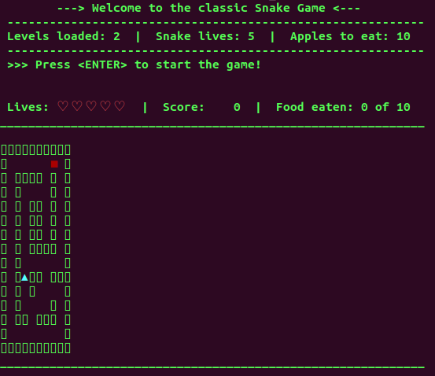

# Snake-Game-Simulation
A simulation of the classic Snake arcade video game with a twist: the snake is trapped inside a maze!

The Snaze game simulation loads the maze levels from an input text file, provided via command line arguments, and controls the snake movements.

## Students:
Camila Duarte and Weverson Paulo

## Compilation:
1. `g++ src/main.cpp include/*.h`

## Example of execution:
2. `./a.out "maze_files/game1.dat"`

## The opening screen of the Snaze game:

